# Fiddler

## 技术目的

1. 内嵌App的H5页面, 测试某些Bug时, 必须得在真机环境下, 故而, 能抓到App请求的文件, 替换成本地文件进行实时调试, 实时反馈就很重要

2. 本次总共三步

## Fiddler抓包Http请求(Android)

1. Fiddler 下载地址 ：`https://www.telerik.com/download/fiddler`

2. Fiddler通过改写HTTP代理，让数据从它那通过，来监控并且截取到数据, 开启抓包功能时就设置好了浏览器代理, 当关闭时, 又把代理还原

    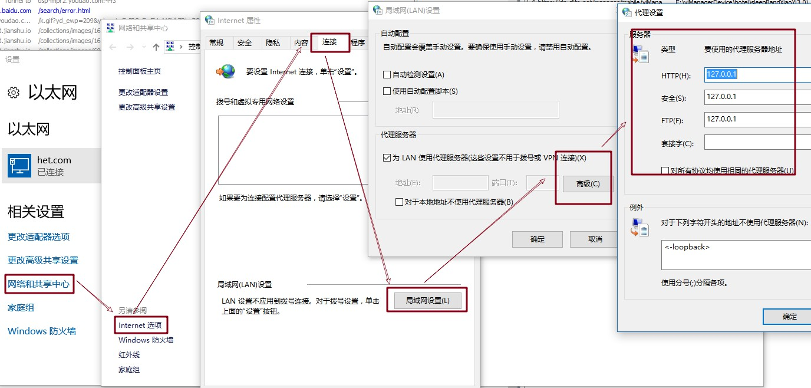

### Fiddler功能字段

1. 开启/关闭抓包功能

    File –> Capture Traffic 或 点击左下角`Capturing`切换

    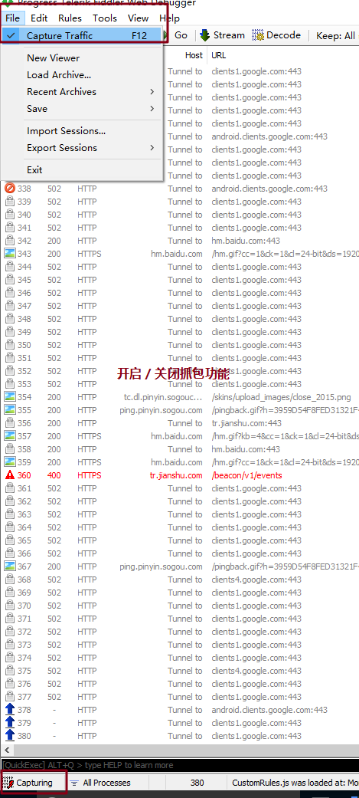

#### 抓包列表及字段说明

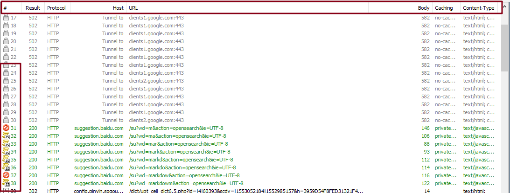
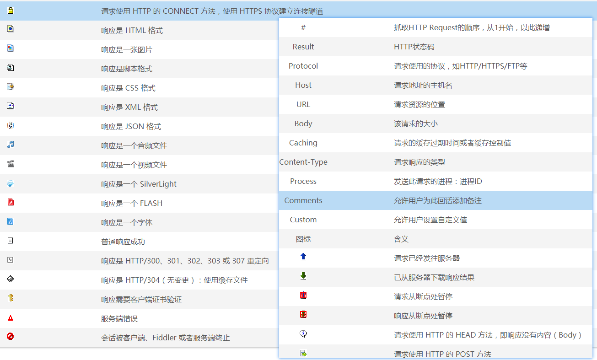

#### 右边部分

1) Statistics 关于HTTP请求的性能以及数据分析

    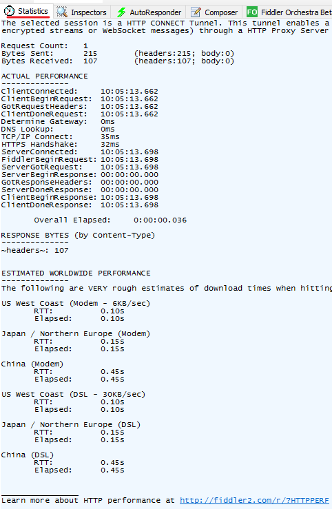

2) Inspectors 查看数据内容

    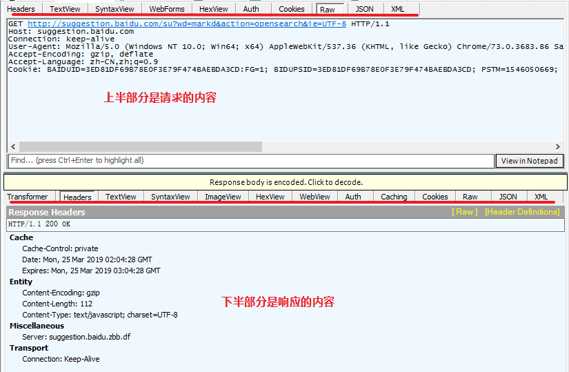

#### AutoResponder 允许拦截指定规则的请求(本次重点, 第三步)

1. 概念: 允许拦截指定请求，并返回本地资源或Fiddler资源，从而代替服务器响应

2. 注意: 修改了拦截规则, 需要重新勾选一下`Enable rules`, 拦截的http可以不全部匹配

    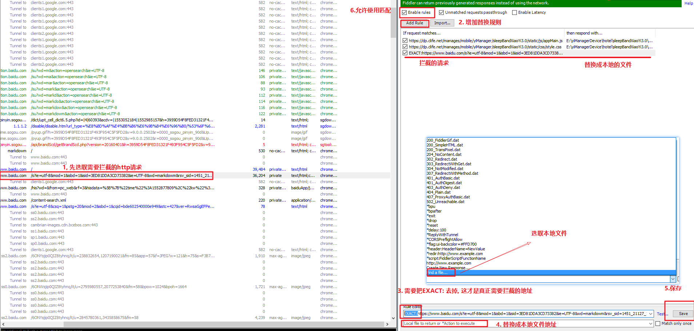

#### Composer 自定义请求发送服务器

1. 概念: Composer允许自定义请求发送到服务器，可以手动创建一个新的请求，也可以在会话表中，拖拽一个现有的请求

2. Parsed模式下你只需要提供简单的URLS地址即可（如下图，也可以在RequestBody定制一些属性，如模拟浏览器User-Agent）

    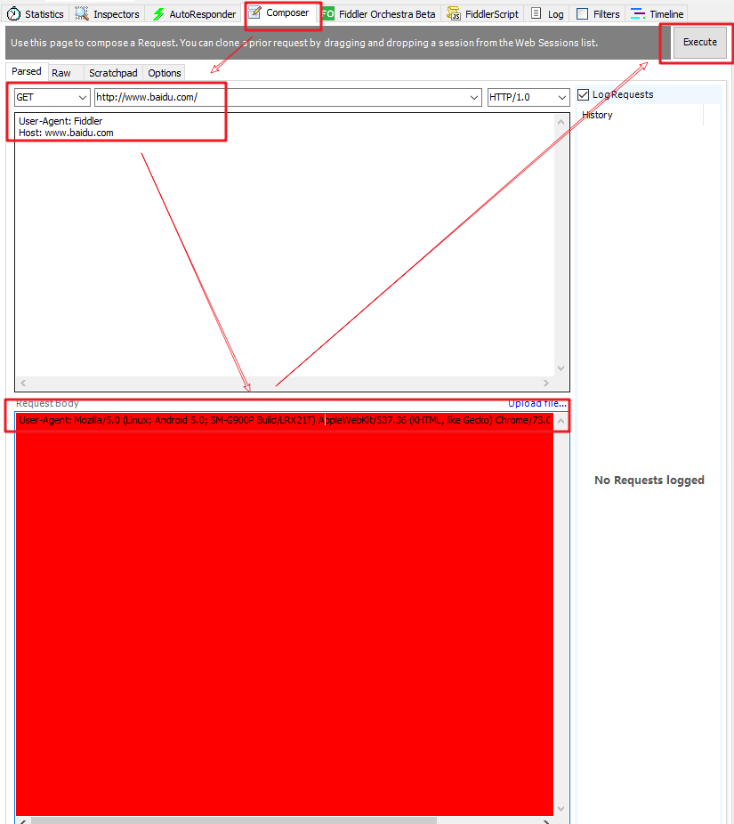

#### Filters 请求过滤规则

1. 概念: 设置过滤规则来过滤掉那些不想看到的请求

2. 勾选左上角的Use Filters开启过滤器，这里有两个最常用的过滤条件：Zone和Host

    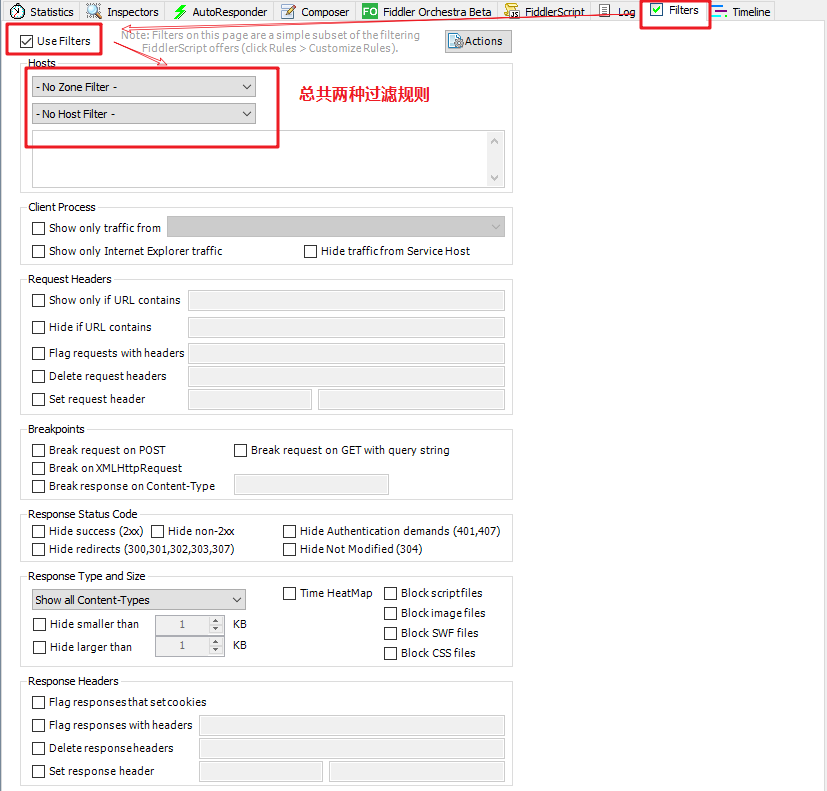

3. Zone 指定只显示内网（Intranet）或互联网（Internet）的内容

    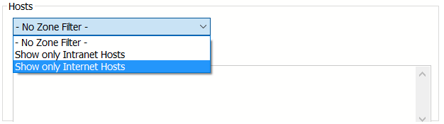

4. Host 指定显示某个域名下的会话, 黄色框（如图）表示修改未生效，点击红圈里的文字即可

    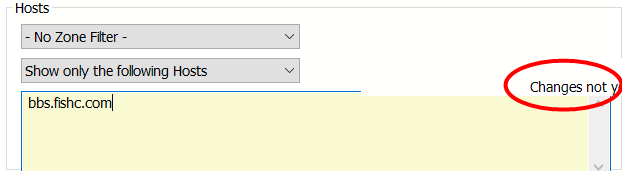

### Fiddler 设置解密HTTPS的网络数据(证书的解密模式, 第一步)

1. 通过伪造CA证书欺骗浏览器和服务器, 大概是, 在浏览器面前伪造成https服务器, 在https服务器前伪造成浏览器, 从而实现解密https数据包

2. 手动开启解密Https

3. Tool -> Fiddler Options -> Https

    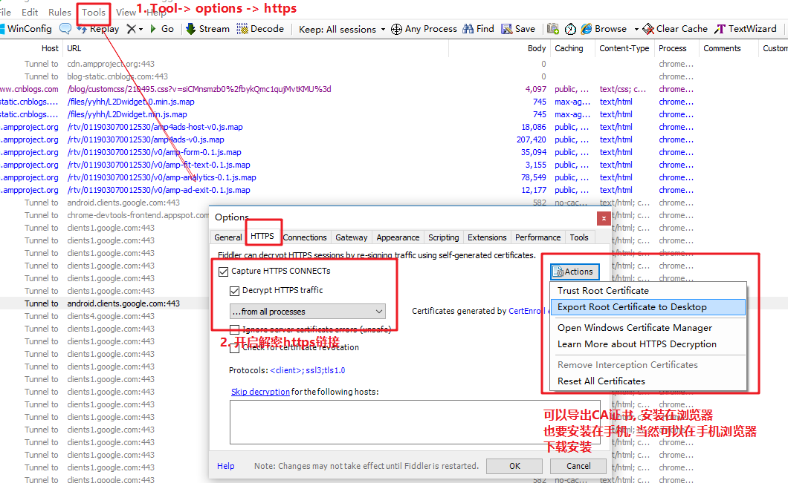

## Fiddler抓取 Iphone / Android数据包

### 原理 (第二步)

1. 概念: Fiddler通过热点, 开启代理, 然后抓取移动端设备的数据包

    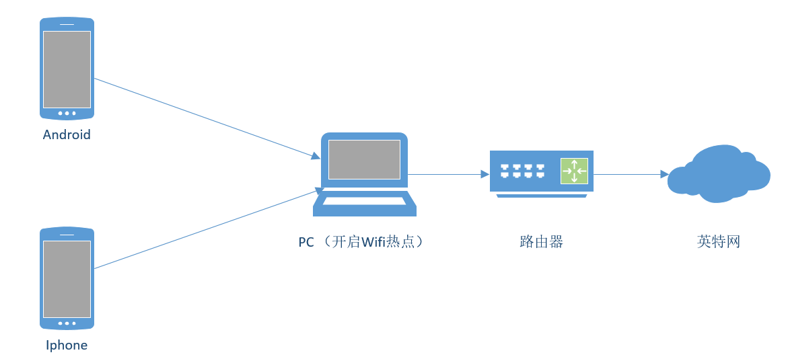

2. `手机和开启Fiddler的电脑, 用同一个热点`

3. 打开Fiddler, [Tools] –> [Fiddler Options] -> [Connections] ，设置代理端口是8888， 勾选 `Allow remote computers to connect`， 点击OK

    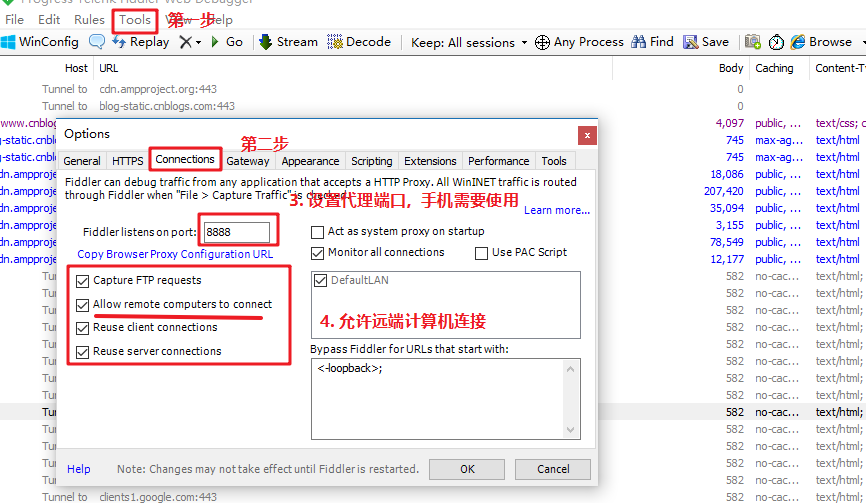

4. 此时, 在Fiddler中就可以看到本机无线网卡的IP(没有就重启)

    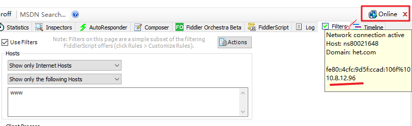

5. 手机设置手动代理(Iphone)

    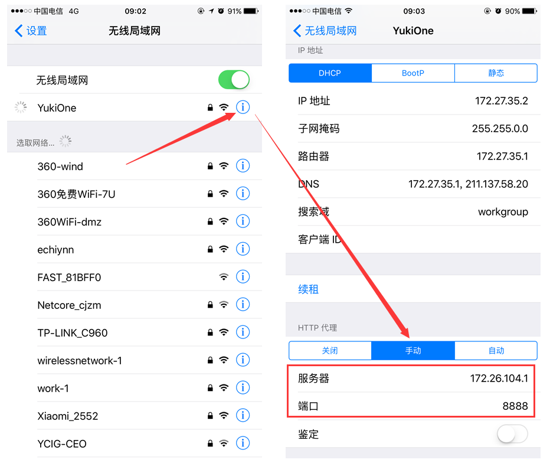

6. 安装证书, 访问网页输入代理IP和端口，下载Fiddler的证书, `FiddlerRoot certificate`

    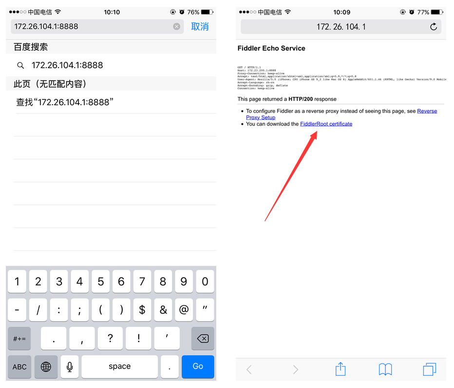

7. 如果打开浏览器碰到类似下面的报错，请打开Fiddler的证书解密模式（Fiddler 设置解密HTTPS的网络数据）

        `No root certificate was found. Have you enabled HTTPS traffic decryption in Fiddler yet?`

8. 手机安装证书

    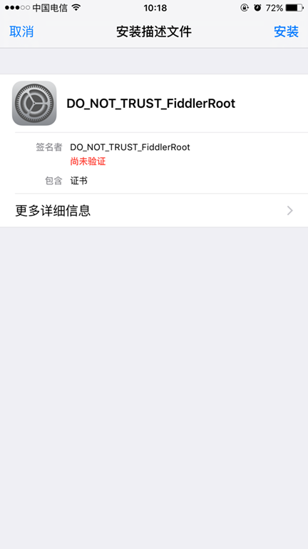

9. 安装完证书, 需要手动添加一下证书信任，设置 - 通用 - 关于本机，最下面有个信任证书设置按钮

10. 此时就可以在Fiddler中监控http请求(重启Fiddler, 重启手机, 不行的话)

## Fiddler的用法

1. win系统下使用Fiddler: Android 和 ios手机都可以抓包

2. Mac下Fiddler不好用, 可用Charles代替